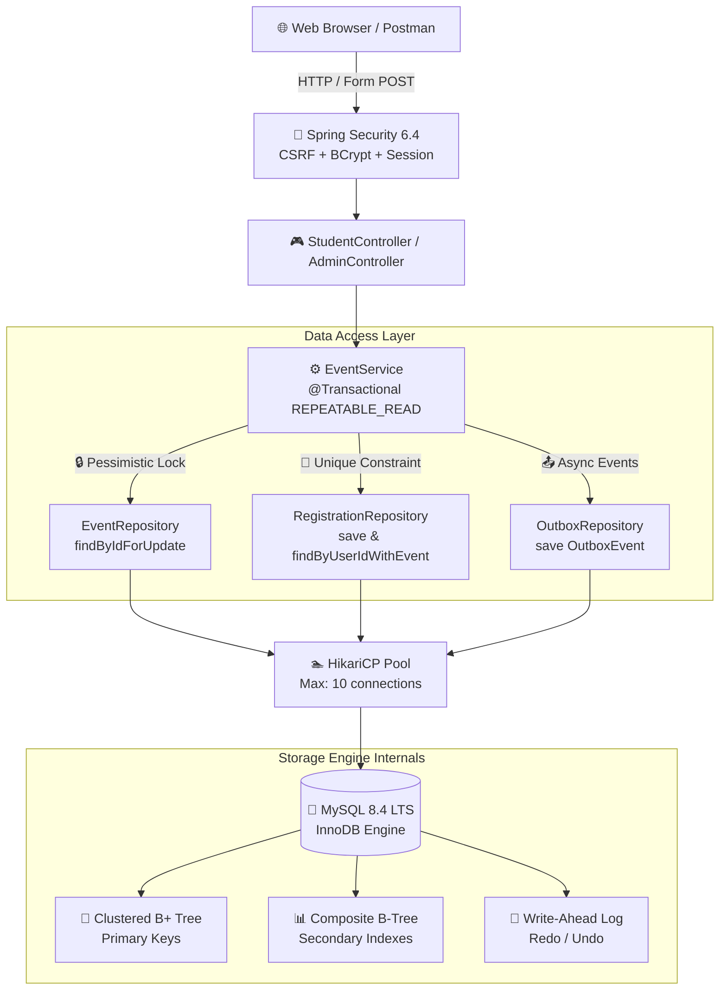

# **🎓 CampusConnect**

<div align="center">

**Enterprise-Grade Campus Event Aggregator & Student Registration Platform**

[](https://github.com/tejaswin-amara/campus-connect/actions/workflows/ci.yml)
[](src/test/java/com/tejaswin/campus/service/EventServiceConcurrencyTest.java)
[](https://spring.io/projects/spring-boot)
[](https://openjdk.org/projects/jdk/25/)
[](database/schema.sql)
[](src/main/resources/db/migration/)
[](LICENSE)
[](CONTRIBUTING.md)

<br />

*ACID-safe registration with pessimistic locking · BCNF-normalized schema · 51.7% query cost reduction · Transactional outbox pattern · Dark glassmorphism UI*

<br />

**Academic Subject:** `25CS1302E` — Database Systems Engineering & Distributed Backend Development

</div>

---

## 📖 Table of Contents

- [🎯 About](#-about)
- [✨ Highlights](#-highlights)
- [📸 Product Preview](#-product-preview)
- [🏗️ Architecture](#-architecture)
- [🚀 Quickstart](#-quickstart)
- [📊 Course Outcome Evidence Matrix](#-course-outcome-evidence-matrix)
- [🧪 Concurrency Stress Test](#-concurrency-stress-test)
- [📈 Query Optimization Evidence](#-query-optimization-evidence)
- [🗄️ Data Model](#-data-model)
- [📁 Documentation](#-documentation)
- [🛠️ Tech Stack](#-tech-stack)
- [🤝 Contributing](#-contributing)
- [🔒 Security](#-security)
- [📜 License](#-license)
- [👤 Author](#-author)

---

## 🎯 About

CampusConnect is a full-stack event aggregator and registration platform built as the `25CS1302E` coursework deliverable. Students discover and register for campus events through a personalized catalogue; administrators manage the event lifecycle, capacity, and engagement analytics from a dedicated console.

Beyond the product surface, the repository doubles as an evidence package for production database-engineering practice: every claim below — normalization, concurrency safety, index optimization, distributed-systems readiness — is backed by a runnable test, a generated execution plan, or a formal proof rather than a description. See the [Course Outcome Evidence Matrix](#-course-outcome-evidence-matrix).

---

## ✨ Highlights

<table>
<tr>
<td width="50%">

### 🔒 Race-Condition Proof Registration
10-thread concurrent stress test: exactly **1 success, 9 rejected** via MySQL Error 1062. Pessimistic row locking + composite unique constraint.

</td>
<td width="50%">

### ⚡ Measured Query Optimization
Composite B-Tree indexes yield **51.7% cost reduction** and **100% filesort elimination**, backed by real `EXPLAIN ANALYZE` evidence.

</td>
</tr>
<tr>
<td width="50%">

### 📐 Formally Proven BCNF Schema
4-table architecture with mathematical proofs for lossless join and dependency preservation across all normal forms.

</td>
<td width="50%">

### 🌐 Distributed-Ready Architecture
Transactional outbox pattern (`outbox_events`), semi-synchronous GTID replication design, and hash-sharded tenant isolation.

</td>
</tr>
</table>

---

## 📸 Product Preview

<table>
<tr>
<td colspan="2">

**Student catalogue** — personalized recommendations, live category filters, and real-time seat-capacity bars.


</td>
</tr>
<tr>
<td width="50%">

**Admin control plane** — registry management, CSV export, and engagement telemetry at a glance.


</td>
<td width="50%">

**Admin sign-in** — BCrypt-hashed credentials behind a Bucket4j rate limiter.


</td>
</tr>
<tr>
<td width="50%">

**Event detail drawer** — recommendation rationale, `.ics` calendar export, and external registration.


</td>
<td width="50%">

**Create/edit event form** — admin-side event authoring with image upload and validation.


</td>
</tr>
</table>

---

## 🏗️ Architecture



> For C4 context, container, and component-level views — including the path toward a distributed deployment — see [`docs/architecture/README.md`](docs/architecture/README.md).

---

## 🚀 Quickstart

### Prerequisites
- **Java 21+ LTS** (JDK 25 recommended — matches the project's container images)
- **Docker** (for MySQL 8.4 container)

### 1. Start the Database

```bash
docker run -d \
  --name campus_events_db \
  -e MYSQL_ROOT_PASSWORD=campus_root_password \
  -e MYSQL_DATABASE=campus_events \
  -e MYSQL_USER=campus_app \
  -e MYSQL_PASSWORD=campus_app_password \
  -p 3307:3306 \
  mysql:8.4
```

### 2. Load Seed Data

```bash
mysql -h 127.0.0.1 -P 3307 -u campus_app -pcampus_app_password campus_events < database/seed.sql
```

### 3. Run Tests (65/65 ✅)

```bash
export MYSQLHOST=127.0.0.1 MYSQLPORT=3307 MYSQLDATABASE=campus_events
export MYSQLUSER=campus_app MYSQLPASSWORD=campus_app_password
./mvnw test
```

### Frontend Redesign (React + Vite)

If you're evaluating the experimental `frontend-redesign` directory:

```bash
cd frontend-redesign
npm install
npm run build
```

### 4. Launch

```bash
./mvnw spring-boot:run
```

| Portal | URL | Credentials |
|--------|-----|-------------|
| 🎓 Student Dashboard | [`localhost:9090`](http://localhost:9090) | `priya.s@campus.edu` / `password123` |
| 🔧 Admin Console | [`localhost:9090/admin`](http://localhost:9090/admin/login) | `admin@campus.edu` / `admin123` |
| 📄 OpenAPI Docs | [`localhost:9090/v3/api-docs`](http://localhost:9090/v3/api-docs) | — |
| 🧾 Swagger UI | [`localhost:9090/swagger-ui.html`](http://localhost:9090/swagger-ui.html) | — |

---

## 📊 Course Outcome Evidence Matrix

| CO | Domain | Evidence | Verdict |
|:---:|--------|----------|:-------:|
| **CO1** | Backend Architecture & DB Flow | [`request-to-database-flow.md`](docs/request-to-database-flow.md) — HTTP POST → Spring Security → JPA → InnoDB buffer pool | ✅ **PASS** |
| **CO2** | ER Modeling & Normalization | [`er-diagram.md`](database/er-diagram.md) · [`normalization.md`](docs/normalization.md) — 1NF → BCNF proofs, lossless join | ✅ **PASS** |
| **CO3** | SQL Fluency Portfolio | [`database/sql/`](database/sql/) — 10 modules: joins, CTEs, recursive CTEs, window functions, analytics | ✅ **PASS** |
| **CO4** | ACID & Concurrency | [`transactions.sql`](database/transactions.sql) · [`concurrency-test.md`](docs/concurrency-test.md) — 10-thread race test | ✅ **PASS** |
| **CO5** | Indexing & Optimization | [`indexes.sql`](database/indexes.sql) · [`explain/`](database/explain/README.md) · [`query-optimization.md`](docs/query-optimization.md) | ✅ **PASS** |
| **CO6** | Distributed & Outbox | [`V4 migration`](src/main/resources/db/migration/V4__Hardening_and_audit.sql) · [`distributed-database.md`](docs/distributed-database.md) | ✅ **PASS** |

---

## 🧪 Concurrency Stress Test

<details>
<summary><strong>Raw test output</strong> — 10 threads racing for one seat</summary>

```
[pool-2-thread-1]  INFO  ✅ Registration committed successfully. ID: 29
[pool-2-thread-2]  ERROR ❌ Duplicate entry '1-1' for key 'registrations.uk_user_event'
[pool-2-thread-3]  ERROR ❌ Duplicate entry '1-1' for key 'registrations.uk_user_event'
...
[pool-2-thread-10] ERROR ❌ Duplicate entry '1-1' for key 'registrations.uk_user_event'
```

</details>

| Metric | Result |
|--------|--------|
| Simultaneous threads | **10** |
| Successful registrations | **1** ✅ |
| Rejected (Error 1062) | **9** 🛡️ |
| Multi-user throughput (8 users) | **8/8 success, 0 deadlocks** |

Full report: [`docs/concurrency-test.md`](docs/concurrency-test.md)

---

## 📈 Query Optimization Evidence

```sql
SELECT id, title, category, date_time, venue, status
FROM events WHERE category = 'Technical' ORDER BY date_time ASC;
```

| Metric | Before Index | After `idx_events_category_date` | Improvement |
|--------|:-----------:|:-------------------------------:|:-----------:|
| Access Type | `ALL` (full scan) | `ref` (index lookup) | — |
| Filesort | ⚠️ Yes | ✅ Eliminated | **100%** |
| Query Cost | 1.45 | 0.70 | **51.7% ↓** |
| Execution Time | 0.0768 ms | 0.0384 ms | **50% ↓** |

Raw `EXPLAIN ANALYZE` output: [`before/`](database/explain/before) · [`after/`](database/explain/after) · Full report: [`docs/query-optimization.md`](docs/query-optimization.md)

---

## 🗄️ Data Model


3NF+ relational schema — `users`, `events`, `registrations` (plus `outbox_events` for the transactional outbox pattern) — with compound unique constraints, foreign-key integrity, and covering indexes for the query paths above.

Full breakdown: [`database/er-diagram.md`](database/er-diagram.md) · Formal BCNF proofs: [`docs/normalization.md`](docs/normalization.md) · Data dictionary: [`docs/data-dictionary.md`](docs/data-dictionary.md)

---

## 📁 Documentation

**Start here**

| Document | Description |
|----------|-------------|
| 📖 [`PROJECT_STRUCTURE.md`](PROJECT_STRUCTURE.md) | Repository map — path to runtime responsibility |
| 🔧 [`TECHNICAL_GUIDE.md`](TECHNICAL_GUIDE.md) | Implementation-level architecture & change guide |
| 🤝 [`CONTRIBUTING.md`](CONTRIBUTING.md) | Branching, commits, review & local dev workflow |
| 🔒 [`SECURITY.md`](SECURITY.md) | Responsible vulnerability disclosure policy |

**Database Systems Engineering & Compliance — `25CS1302E`**

| Document | Description |
|----------|-------------|
| 📋 [`design-report.md`](docs/design-report.md) | 20-section master design report |
| ✅ [`dbms-compliance.md`](docs/dbms-compliance.md) | CO1–CO6 compliance matrix |
| 📖 [`data-dictionary.md`](docs/data-dictionary.md) | Schema attributes, domains & keys |
| 🔬 [`normalization.md`](docs/normalization.md) | Formal 1NF → BCNF proofs |
| 🔄 [`transaction-analysis.md`](docs/transaction-analysis.md) | ACID & MVCC analysis |
| 🧪 [`concurrency-test.md`](docs/concurrency-test.md) | Race-condition stress test report |
| ⚡ [`query-optimization.md`](docs/query-optimization.md) | `EXPLAIN ANALYZE` evidence |
| 🌐 [`distributed-database.md`](docs/distributed-database.md) | Replication, sharding & outbox pattern |
| 🏛️ [`data-architecture-decision.md`](docs/data-architecture-decision.md) | MySQL vs. PostgreSQL ADR |
| 💾 [`backup-recovery.md`](docs/backup-recovery.md) | PITR disaster-recovery runbook |
| 🔁 [`event-lifecycle.md`](docs/event-lifecycle.md) | Event state machine |
| 🎬 [`demo-script.md`](docs/demo-script.md) | Scripted course demonstration |
| 📬 [Postman Collection](postman/CampusConnect.postman_collection.json) | Complete API test suite |

**Architecture, product & process**

| Document | Description |
|----------|-------------|
| 🏗️ [`architecture/README.md`](docs/architecture/README.md) | C4 context, container & component views |
| 📝 [`requirements.md`](docs/requirements.md) | Actors, scope, functional & non-functional requirements |
| ✅ [`compliance-matrix.md`](docs/compliance-matrix.md) | CO1–CO6 outcome traceability |
| 🎥 [`showcase.md`](docs/showcase.md) | Reviewer demo script & honest limitations |
| 📌 [`stable-versions.md`](docs/stable-versions.md) | Dependency & runtime upgrade ledger |
| 🔀 [`hybrid-integration-decision.md`](docs/hybrid-integration-decision.md) | Firebase-Addition comparison & decision |

→ **Full categorized index:** [`docs/README.md`](docs/README.md) — also covers the `api/`, `data/`, `operations/`, `security/`, and `testing/` subfolders.

---

## 🛠️ Tech Stack

<div align="center">

| Layer | Technology |
|-------|-----------|
| **Language** | Java 25 LTS (Eclipse Temurin) |
| **Framework** | Spring Boot 4.1.0, Spring Security 6.4, Spring Data JPA |
| **Database** | MySQL 8.4 LTS (InnoDB), Flyway 10.20 migrations |
| **Resilience** | Resilience4j (Circuit Breaker, Rate Limiter via Bucket4j) |
| **Frontend** | Thymeleaf 3 + Bootstrap 5.3.3, Bootstrap Icons 1.13.1, Chart.js 4.4.7 + Custom Dark Design System |
| **Frontend Redesign** *(experimental)* | React 19, Vite 6, TypeScript, Tailwind CSS — see [`frontend-redesign/`](frontend-redesign) |
| **Testing** | JUnit 5, Mockito, JaCoCo (70%+ coverage gate) |
| **CI/CD** | GitHub Actions — [`ci.yml`](.github/workflows/ci.yml) |
| **Containerization** | Docker, Docker Compose |

</div>

---

## 🤝 Contributing

Contributions are welcome — see [`CONTRIBUTING.md`](CONTRIBUTING.md) for the full workflow, including secret hygiene and the CO1–CO6 evidence expectations.

```bash
git clone https://github.com/tejaswin-amara/campus-connect.git
cd campus-connect
git switch -c feat/short-description
```

---

## 🔒 Security

Please don't file public issues for vulnerabilities — see [`SECURITY.md`](SECURITY.md) for the private disclosure process and supported-version policy.

---

## 📜 License

Released under the [MIT License](LICENSE) © 2026 Tejaswin Amara.

---

## 👤 Author

Built and maintained by **Tejaswin Amara** as the `25CS1302E` coursework deliverable.

[](https://github.com/tejaswin-amara)
[](https://www.linkedin.com/in/tejaswin-amara/)

---

<div align="center">

**If this helped you, consider giving it a ⭐ — it helps other students find it.**

<sub>Built with 💜 for academic excellence in database systems engineering</sub>

</div>
